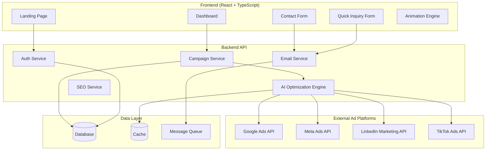
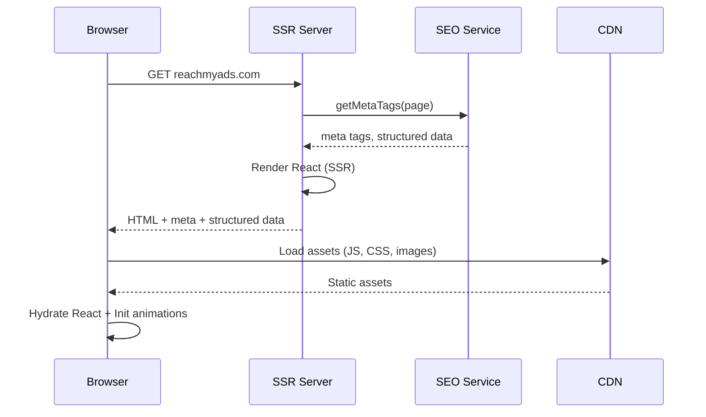
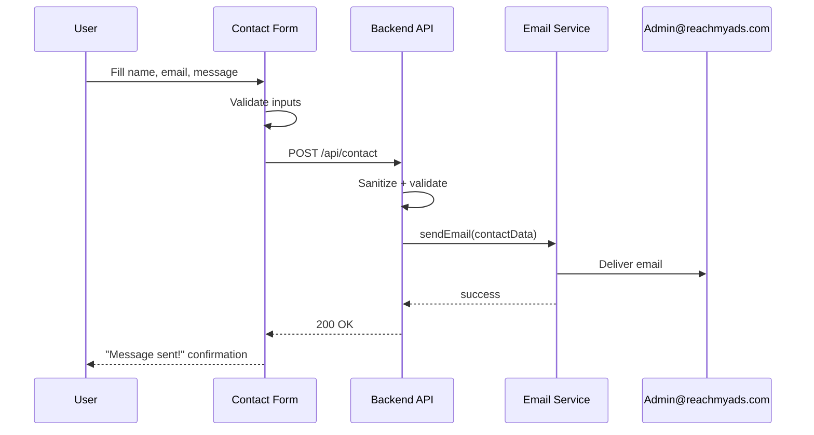
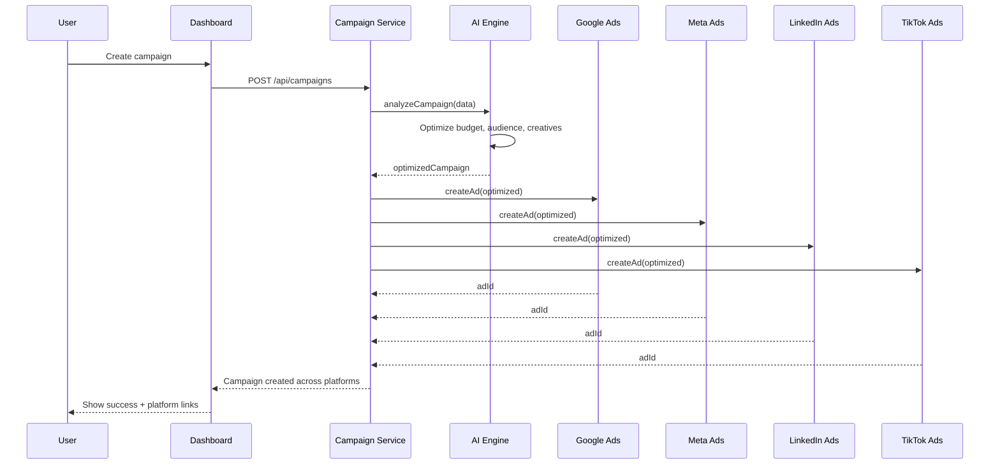

# Design Document: ReachMyAds Website

## Overview

ReachMyAds is an AI-driven ad management platform that enables business owners and ad agencies to create, manage, and optimize advertising campaigns across Google, Meta, LinkedIn, and TikTok from a single unified dashboard. The platform leverages AI to analyze campaign performance, suggest optimizations, and automate ad distribution across channels.

The website (reachmyads.com) serves as both the marketing landing page and the application entry point. It features a modern, next-gen UI with smooth animations, SEO-optimized content, a contact form routing to Admin@reachmyads.com, and a quick inquiry form for prospective clients. The frontend is built with React (TypeScript) using a component-driven architecture with server-side rendering for SEO.

The platform connects to major ad network APIs (Google Ads, Meta Ads, LinkedIn Marketing, TikTok Ads) and wraps them behind an AI optimization layer that recommends budget allocation, audience targeting, and creative variations.

## Architecture



## Sequence Diagrams

### Landing Page Load (SEO-Optimized)



### Contact Form Submission



### AI Ad Optimization Flow



## Components and Interfaces

### Component 1: Landing Page

**Purpose**: SEO-optimized marketing page with animations, hero section, features showcase, testimonials, pricing, and CTAs.

```typescript
interface LandingPageProps {
  seoMeta: SEOMetadata;
  heroContent: HeroContent;
  features: Feature[];
  testimonials: Testimonial[];
  pricingPlans: PricingPlan[];
}

interface SEOMetadata {
  title: string;
  description: string;
  keywords: string[];
  ogImage: string;
  canonicalUrl: string;
  structuredData: JsonLd;
}

interface HeroContent {
  headline: string;
  subheadline: string;
  ctaText: string;
  ctaLink: string;
  backgroundAnimation: AnimationConfig;
}

interface Feature {
  id: string;
  icon: string;
  title: string;
  description: string;
  animationDelay: number;
}
```

**Responsibilities**:
- Render SEO meta tags and structured data (JSON-LD)
- Display hero section with animated background
- Showcase platform features with scroll-triggered animations
- Present testimonials carousel
- Show pricing plans with comparison
- Include CTAs that route to signup/contact

### Component 2: Contact Form

**Purpose**: Collects client queries and sends email to Admin@reachmyads.com.

```typescript
interface ContactFormProps {
  recipientEmail: string; // Admin@reachmyads.com
  onSubmitSuccess: () => void;
  onSubmitError: (error: string) => void;
}

interface ContactFormData {
  name: string;
  email: string;
  company?: string;
  phone?: string;
  message: string;
  honeypot?: string; // spam protection
}

interface ContactFormState {
  isSubmitting: boolean;
  isSubmitted: boolean;
  errors: Record<string, string>;
}
```

**Responsibilities**:
- Validate form inputs (email format, required fields)
- Honeypot spam protection
- Rate limiting on submissions
- Send data to backend API
- Show success/error feedback with animations

### Component 3: Quick Inquiry Form

**Purpose**: Lightweight inline form for fast client inquiries.

```typescript
interface QuickInquiryProps {
  placement: 'header' | 'sidebar' | 'footer' | 'floating';
}

interface QuickInquiryData {
  email: string;
  inquiry: string;
}
```

**Responsibilities**:
- Minimal fields for fast submission (email + message)
- Inline validation
- Submit to same email endpoint
- Floating/sticky positioning option

### Component 4: Animation Engine

**Purpose**: Manages scroll-triggered animations, page transitions, and micro-interactions.

```typescript
interface AnimationConfig {
  type: 'fadeIn' | 'slideUp' | 'slideLeft' | 'scaleIn' | 'parallax' | 'typewriter' | 'morphing';
  duration: number;       // ms
  delay: number;          // ms
  easing: string;         // CSS easing function
  triggerOnScroll: boolean;
  threshold: number;      // 0-1, viewport intersection ratio
}

interface AnimationEngineAPI {
  registerElement(el: HTMLElement, config: AnimationConfig): void;
  unregisterElement(el: HTMLElement): void;
  triggerAnimation(el: HTMLElement): void;
  pauseAll(): void;
  resumeAll(): void;
}
```

**Responsibilities**:
- Intersection Observer-based scroll animations
- Page transition animations
- Micro-interactions (hover, click feedback)
- Performance-optimized (requestAnimationFrame, will-change)
- Respects prefers-reduced-motion

### Component 5: Dashboard (Ad Management)

**Purpose**: Main application interface for managing campaigns across platforms.

```typescript
interface DashboardProps {
  user: AuthenticatedUser;
  campaigns: Campaign[];
  analytics: AnalyticsSummary;
}

interface Campaign {
  id: string;
  name: string;
  status: 'draft' | 'active' | 'paused' | 'completed';
  platforms: AdPlatform[];
  budget: Budget;
  targeting: TargetingConfig;
  creatives: AdCreative[];
  aiScore: number;          // 0-100 AI optimization score
  performance: CampaignMetrics;
  createdAt: Date;
  updatedAt: Date;
}

type AdPlatform = 'google' | 'meta' | 'linkedin' | 'tiktok';

interface Budget {
  total: number;
  currency: string;
  dailyLimit: number;
  platformAllocation: Record<AdPlatform, number>; // percentage per platform
}
```

### Component 6: AI Optimization Engine Interface

**Purpose**: Frontend interface to the AI recommendation system.

```typescript
interface AIOptimizationAPI {
  analyzeCampaign(campaign: Campaign): Promise<AIRecommendation>;
  optimizeBudget(campaign: Campaign): Promise<BudgetRecommendation>;
  suggestAudience(campaign: Campaign): Promise<AudienceRecommendation>;
  generateCreatives(brief: CreativeBrief): Promise<AdCreative[]>;
  predictPerformance(campaign: Campaign): Promise<PerformancePrediction>;
}

interface AIRecommendation {
  overallScore: number;
  budgetSuggestions: BudgetRecommendation;
  audienceSuggestions: AudienceRecommendation;
  creativeSuggestions: string[];
  platformPriority: AdPlatform[];
  confidence: number;
}

interface PerformancePrediction {
  estimatedReach: number;
  estimatedClicks: number;
  estimatedConversions: number;
  estimatedCPC: number;
  estimatedROAS: number;
  confidenceInterval: [number, number];
}
```

## Data Models

### User Model

```typescript
interface User {
  id: string;
  email: string;
  name: string;
  company?: string;
  role: 'admin' | 'manager' | 'viewer';
  connectedPlatforms: PlatformConnection[];
  createdAt: Date;
}

interface PlatformConnection {
  platform: AdPlatform;
  accountId: string;
  accessToken: string;   // encrypted
  refreshToken: string;  // encrypted
  isActive: boolean;
  lastSyncAt: Date;
}
```

**Validation Rules**:
- Email must be valid format
- Name is required, 1-100 characters
- Role must be one of the defined enum values
- Access tokens must be encrypted at rest

### Campaign Model

```typescript
interface CampaignRecord {
  id: string;
  userId: string;
  name: string;
  status: CampaignStatus;
  platforms: AdPlatform[];
  budget: Budget;
  targeting: TargetingConfig;
  creatives: AdCreative[];
  platformCampaignIds: Record<AdPlatform, string>;
  aiOptimizationHistory: AIRecommendation[];
  metrics: CampaignMetrics;
  createdAt: Date;
  updatedAt: Date;
}

interface TargetingConfig {
  ageRange: [number, number];
  genders: ('male' | 'female' | 'all')[];
  locations: GeoTarget[];
  interests: string[];
  keywords: string[];
  customAudiences: string[];
}

interface AdCreative {
  id: string;
  type: 'image' | 'video' | 'carousel' | 'text';
  headline: string;
  description: string;
  mediaUrl?: string;
  callToAction: string;
  platformVariants: Record<AdPlatform, PlatformCreative>;
}

interface CampaignMetrics {
  impressions: number;
  clicks: number;
  conversions: number;
  spend: number;
  cpc: number;
  ctr: number;
  roas: number;
  lastUpdated: Date;
}
```

**Validation Rules**:
- Campaign name: 1-200 characters, unique per user
- Budget total must be positive
- Daily limit must not exceed total budget
- Platform allocation percentages must sum to 100
- Age range: min 13, max 65+
- At least one platform must be selected


### Contact Submission Model

```typescript
interface ContactSubmission {
  id: string;
  name: string;
  email: string;
  company?: string;
  phone?: string;
  message: string;
  source: 'contact_form' | 'quick_inquiry';
  ipAddress: string;       // for rate limiting
  submittedAt: Date;
  emailSentAt?: Date;
  status: 'pending' | 'sent' | 'failed';
}
```

**Validation Rules**:
- Name: required, 1-100 characters, no HTML
- Email: required, valid email format
- Message: required, 10-5000 characters, sanitized
- Phone: optional, valid phone format if provided
- Rate limit: max 3 submissions per IP per hour

## Key Functions with Formal Specifications

### Function 1: submitContactForm()

```typescript
async function submitContactForm(data: ContactFormData): Promise<SubmissionResult>
```

**Preconditions:**
- `data.name` is non-empty string, length 1-100
- `data.email` is valid email format
- `data.message` is non-empty string, length 10-5000
- Client has not exceeded rate limit (3 per hour per IP)
- `data.honeypot` field is empty (bot detection)

**Postconditions:**
- Returns `SubmissionResult` with `success: true` if email queued
- Email is queued for delivery to Admin@reachmyads.com
- `ContactSubmission` record is persisted with status `'pending'`
- If rate limited: returns `success: false` with appropriate error
- Input data is sanitized (HTML stripped, XSS prevented)
- No raw user input stored without sanitization

**Loop Invariants:** N/A

### Function 2: optimizeCampaignWithAI()

```typescript
async function optimizeCampaignWithAI(campaign: Campaign): Promise<AIRecommendation>
```

**Preconditions:**
- `campaign` is non-null with valid `id`
- `campaign.platforms` has at least one platform
- `campaign.budget.total > 0`
- User has active connections to all specified platforms

**Postconditions:**
- Returns `AIRecommendation` with `overallScore` between 0-100
- `budgetSuggestions.platformAllocation` percentages sum to 100
- `confidence` is between 0-1
- `platformPriority` contains only platforms from `campaign.platforms`
- Recommendation is persisted in `campaign.aiOptimizationHistory`
- No external API calls are made during analysis (uses cached platform data)

**Loop Invariants:**
- For platform iteration: all previously analyzed platforms have valid scores

### Function 3: pushCampaignToPlatforms()

```typescript
async function pushCampaignToPlatforms(
  campaign: Campaign,
  platforms: AdPlatform[]
): Promise<PlatformPushResult[]>
```

**Preconditions:**
- `campaign.status` is `'draft'` or `'paused'`
- All platforms in `platforms` array have active user connections
- `campaign.creatives` has at least one creative
- `campaign.budget.total > 0`
- Each platform in `platforms` has a corresponding `platformVariant` in at least one creative

**Postconditions:**
- Returns array of `PlatformPushResult`, one per platform
- For each successful push: `platformCampaignIds[platform]` is set
- Campaign status transitions to `'active'`
- Failed platforms do not affect successful ones (partial success allowed)
- All API calls are idempotent (safe to retry)

**Loop Invariants:**
- For each platform push iteration: previously pushed platforms remain unaffected
- Running count of successes + failures equals number of processed platforms

### Function 4: renderWithSEO()

```typescript
function renderWithSEO(page: PageConfig): SSRResult
```

**Preconditions:**
- `page.seoMeta` contains non-empty `title` and `description`
- `page.seoMeta.canonicalUrl` is a valid URL on reachmyads.com domain
- `page.seoMeta.structuredData` is valid JSON-LD

**Postconditions:**
- Returned HTML contains `<title>` matching `page.seoMeta.title`
- Returned HTML contains `<meta name="description">` matching `page.seoMeta.description`
- Returned HTML contains valid JSON-LD `<script>` block
- Returned HTML contains Open Graph meta tags
- All images have `alt` attributes
- HTML is valid and parseable

**Loop Invariants:** N/A

## Algorithmic Pseudocode

### Contact Form Submission Algorithm

```typescript
async function handleContactSubmission(
  formData: ContactFormData,
  clientIp: string
): Promise<SubmissionResult> {
  // ASSERT: formData is provided and clientIp is non-empty

  // Step 1: Bot detection
  if (formData.honeypot && formData.honeypot.length > 0) {
    return { success: true, message: "Message sent!" }; // silent reject
  }

  // Step 2: Rate limiting
  const recentSubmissions = await getSubmissionCount(clientIp, LAST_HOUR);
  if (recentSubmissions >= MAX_SUBMISSIONS_PER_HOUR) {
    return { success: false, error: "Too many requests. Please try again later." };
  }

  // Step 3: Validate and sanitize
  const validation = validateContactData(formData);
  if (!validation.isValid) {
    return { success: false, error: validation.errors };
  }
  const sanitized = sanitizeInput(formData);

  // Step 4: Persist submission
  const submission: ContactSubmission = {
    id: generateId(),
    ...sanitized,
    source: 'contact_form',
    ipAddress: clientIp,
    submittedAt: new Date(),
    status: 'pending'
  };
  await saveSubmission(submission);

  // Step 5: Queue email
  await emailQueue.enqueue({
    to: "Admin@reachmyads.com",
    subject: `New inquiry from ${sanitized.name}`,
    body: formatEmailBody(sanitized),
    replyTo: sanitized.email
  });

  // Step 6: Update status
  await updateSubmissionStatus(submission.id, 'sent');

  // ASSERT: submission is persisted AND email is queued
  return { success: true, message: "Message sent! We'll get back to you soon." };
}
```

### AI Campaign Optimization Algorithm

```typescript
async function runAIOptimization(campaign: Campaign): Promise<AIRecommendation> {
  // ASSERT: campaign is valid with at least one platform and positive budget

  // Step 1: Gather platform performance data
  const platformData: Record<AdPlatform, PlatformAnalytics> = {};
  for (const platform of campaign.platforms) {
    // INVARIANT: all previously fetched platforms have valid analytics
    platformData[platform] = await getCachedPlatformAnalytics(platform, campaign.targeting);
  }

  // Step 2: Analyze audience fit per platform
  const audienceScores: Record<AdPlatform, number> = {};
  for (const platform of campaign.platforms) {
    // INVARIANT: all previously scored platforms have scores in [0, 100]
    audienceScores[platform] = calculateAudienceFit(
      campaign.targeting,
      platformData[platform].audienceProfile
    );
  }

  // Step 3: Optimize budget allocation
  const totalBudget = campaign.budget.total;
  const allocation = optimizeBudgetAllocation(
    campaign.platforms,
    audienceScores,
    platformData,
    totalBudget
  );
  // ASSERT: sum of allocation values === 100

  // Step 4: Rank platforms by predicted ROI
  const platformPriority = campaign.platforms
    .sort((a, b) => audienceScores[b] - audienceScores[a]);

  // Step 5: Generate creative suggestions
  const creativeSuggestions = await generateCreativeSuggestions(
    campaign.creatives,
    platformData,
    campaign.targeting
  );

  // Step 6: Calculate confidence and overall score
  const dataPoints = Object.values(platformData).reduce(
    (sum, pd) => sum + pd.sampleSize, 0
  );
  const confidence = Math.min(dataPoints / CONFIDENCE_THRESHOLD, 1.0);
  const overallScore = calculateWeightedScore(audienceScores, allocation);

  // ASSERT: overallScore in [0, 100] AND confidence in [0, 1]
  return {
    overallScore,
    budgetSuggestions: { platformAllocation: allocation },
    audienceSuggestions: deriveAudienceRecommendations(platformData),
    creativeSuggestions,
    platformPriority,
    confidence
  };
}
```

### SEO Rendering Algorithm

```typescript
function buildSEOHead(page: PageConfig): string {
  // ASSERT: page.seoMeta has title, description, canonicalUrl

  const meta = page.seoMeta;
  const tags: string[] = [];

  // Core meta tags
  tags.push(`<title>${escapeHtml(meta.title)}</title>`);
  tags.push(`<meta name="description" content="${escapeHtml(meta.description)}" />`);
  tags.push(`<link rel="canonical" href="${meta.canonicalUrl}" />`);

  // Open Graph tags
  tags.push(`<meta property="og:title" content="${escapeHtml(meta.title)}" />`);
  tags.push(`<meta property="og:description" content="${escapeHtml(meta.description)}" />`);
  tags.push(`<meta property="og:url" content="${meta.canonicalUrl}" />`);
  tags.push(`<meta property="og:type" content="website" />`);
  if (meta.ogImage) {
    tags.push(`<meta property="og:image" content="${meta.ogImage}" />`);
  }

  // Twitter Card tags
  tags.push(`<meta name="twitter:card" content="summary_large_image" />`);
  tags.push(`<meta name="twitter:title" content="${escapeHtml(meta.title)}" />`);
  tags.push(`<meta name="twitter:description" content="${escapeHtml(meta.description)}" />`);

  // Keywords
  if (meta.keywords.length > 0) {
    tags.push(`<meta name="keywords" content="${meta.keywords.join(', ')}" />`);
  }

  // Structured Data (JSON-LD)
  tags.push(`<script type="application/ld+json">${JSON.stringify(meta.structuredData)}</script>`);

  // ASSERT: tags array contains title, description, canonical, og tags, and JSON-LD
  return tags.join('\n');
}
```


## Example Usage

```typescript
// Example 1: Landing page with SEO
const landingPage: PageConfig = {
  seoMeta: {
    title: "ReachMyAds - AI-Driven Ad Management Platform",
    description: "Create, manage, and optimize ads across Google, Meta, LinkedIn, and TikTok with AI-powered insights.",
    keywords: ["ad management", "AI advertising", "Google Ads", "Meta Ads", "LinkedIn Ads", "TikTok Ads"],
    ogImage: "https://reachmyads.com/og-image.png",
    canonicalUrl: "https://reachmyads.com",
    structuredData: {
      "@context": "https://schema.org",
      "@type": "SoftwareApplication",
      "name": "ReachMyAds",
      "applicationCategory": "BusinessApplication",
      "description": "AI-driven ad management platform"
    }
  }
};
const seoHead = buildSEOHead(landingPage);

// Example 2: Contact form submission
const contactData: ContactFormData = {
  name: "Jane Smith",
  email: "jane@example.com",
  company: "Acme Corp",
  message: "Interested in managing our Google and Meta ad campaigns through your platform."
};
const result = await submitContactForm(contactData);
if (result.success) {
  showToast("Message sent!");
}

// Example 3: AI campaign optimization
const campaign: Campaign = {
  id: "camp_123",
  name: "Summer Sale 2025",
  status: "draft",
  platforms: ["google", "meta", "tiktok"],
  budget: { total: 5000, currency: "USD", dailyLimit: 200, platformAllocation: {} },
  targeting: {
    ageRange: [25, 45],
    genders: ["all"],
    locations: [{ country: "US", region: "California" }],
    interests: ["e-commerce", "online shopping"],
    keywords: ["summer sale", "discount"],
    customAudiences: []
  },
  creatives: [/* ... */],
  aiScore: 0,
  performance: { impressions: 0, clicks: 0, conversions: 0, spend: 0, cpc: 0, ctr: 0, roas: 0, lastUpdated: new Date() },
  createdAt: new Date(),
  updatedAt: new Date()
};

const recommendation = await optimizeCampaignWithAI(campaign);
console.log(`AI Score: ${recommendation.overallScore}`);
console.log(`Confidence: ${(recommendation.confidence * 100).toFixed(1)}%`);
console.log(`Platform priority: ${recommendation.platformPriority.join(" > ")}`);

// Example 4: Push campaign to platforms
const pushResults = await pushCampaignToPlatforms(campaign, ["google", "meta"]);
for (const result of pushResults) {
  console.log(`${result.platform}: ${result.success ? "Live" : result.error}`);
}
```

## Correctness Properties

*A property is a characteristic or behavior that should hold true across all valid executions of a system-essentially, a formal statement about what the system should do. Properties serve as the bridge between human-readable specifications and machine-verifiable correctness guarantees.*

### Property 1: Input Sanitization

*For any* string input submitted through the Contact_Form or Quick_Inquiry_Form, the sanitized output SHALL contain no HTML tags, no `<script>` elements, and no email header injection characters (newlines in header fields).

**Validates: Requirements 3.3, 12.1**

### Property 2: Rate Limiting Enforcement

*For any* IP address and any 1-hour sliding window, the number of accepted contact form submissions from that IP within the window SHALL never exceed 3.

**Validates: Requirements 4.1, 4.2**

### Property 3: Budget Allocation Integrity

*For any* budget allocation — whether user-created or AI-generated — the platform allocation percentages SHALL sum to exactly 100.

**Validates: Requirements 8.4, 9.2**

### Property 4: Platform Scope Consistency

*For any* Campaign and its corresponding AI_Recommendation, every platform in the recommendation's platform priority list SHALL be a member of the Campaign's platforms list.

**Validates: Requirement 9.3**

### Property 5: AI Score Bounds

*For any* valid Campaign input, the AI_Engine's returned AI_Recommendation SHALL have an overall score in the range [0, 100] and a confidence value in the range [0, 1].

**Validates: Requirement 9.1**

### Property 6: SEO Completeness

*For any* valid PageConfig with non-empty title, description, canonical URL, and structured data, the rendered HTML SHALL contain a `<title>` tag, a `<meta name="description">` tag, a `<link rel="canonical">` tag, Open Graph meta tags, and a valid JSON-LD `<script>` block.

**Validates: Requirements 1.2, 1.4**

### Property 7: Campaign State Machine

*For any* Campaign status and any attempted status transition, the Campaign_Service SHALL accept only the transitions: draft→active, active→paused, paused→active, active→completed, and SHALL reject all other transitions.

**Validates: Requirements 11.1, 11.2**

### Property 8: Idempotent Platform Push

*For any* Campaign and Ad_Platform, pushing the same campaign to the same platform multiple times SHALL produce the same external campaign ID.

**Validates: Requirement 10.4**

### Property 9: Animation Accessibility

*For any* element with any AnimationConfig, when the user's prefers-reduced-motion setting is enabled, the Animation_Engine SHALL set the animation duration to 0 and execute no CSS animations or transitions.

**Validates: Requirement 6.3**

### Property 10: Email Delivery Guarantee

*For any* contact submission with status 'sent', there SHALL exist a corresponding email entry in the message queue with a matching reply-to address.

**Validates: Requirement 14.3**

### Property 11: Contact Form Validation

*For any* contact form input where the name is empty, the email is not a valid email format, or the message is fewer than 10 characters, the Contact_Form validation SHALL reject the submission and return field-specific errors.

**Validates: Requirement 3.2**

### Property 12: Honeypot Bot Detection

*For any* form submission where the Honeypot_Field contains a non-empty value, the system SHALL silently reject the submission (return success to the client but not queue any email).

**Validates: Requirement 3.6**

### Property 13: Campaign Validation

*For any* campaign creation request, the Campaign_Service SHALL reject the request if the campaign name is empty or exceeds 200 characters, the total budget is not positive, the daily limit exceeds the total budget, no Ad_Platform is selected, or the targeting age range minimum is below 13.

**Validates: Requirements 8.1, 8.2, 8.3, 8.5**

### Property 14: Platform Push Independence

*For any* set of Ad_Platforms in a campaign push, a failure on one platform SHALL not prevent successful pushes to the remaining platforms, and the result SHALL contain per-platform success/failure details.

**Validates: Requirement 10.3**

### Property 15: Landing Page Data Rendering

*For any* set of features, testimonials, and pricing plans provided to the Landing_Page, the rendered output SHALL contain the title and description of every feature, the content of every testimonial, and every pricing plan.

**Validates: Requirements 2.2, 2.3, 2.4**

### Property 16: Token Encryption at Rest

*For any* Ad_Platform OAuth token stored by the Campaign_Service, the stored value SHALL be encrypted using AES-256 and SHALL not be equal to the plaintext token value.

**Validates: Requirements 7.2, 12.5**

### Property 17: Form Submission Email Queuing

*For any* valid form submission (from either Contact_Form or Quick_Inquiry_Form) that passes validation and rate limiting, the Email_Service SHALL queue exactly one email to Admin@reachmyads.com containing the submitted data.

**Validates: Requirements 3.1, 5.2**

### Property 18: Platform Push Precondition Validation

*For any* campaign push request, the Campaign_Service SHALL reject the push if the campaign status is not draft or paused, any target platform lacks an active Platform_Connection, the campaign has no creatives, or the budget is not positive.

**Validates: Requirement 10.1**

### Property 19: Image Optimization

*For any* image element rendered on the Landing_Page, the element SHALL include responsive srcset attributes and lazy loading for below-fold images.

**Validates: Requirement 13.2**

### Property 20: CSRF Protection

*For any* form submission with a missing or invalid CSRF token, the backend SHALL reject the submission.

**Validates: Requirement 12.3**

## Error Handling

### Error Scenario 1: Ad Platform API Failure

**Condition**: One or more ad platform APIs return errors during campaign push
**Response**: Mark failed platforms in `PlatformPushResult` with error details. Successfully pushed platforms remain active.
**Recovery**: Retry failed platforms with exponential backoff (max 3 retries). If still failing, notify user with specific platform error and option to retry manually.

### Error Scenario 2: Contact Form Email Delivery Failure

**Condition**: Email service fails to queue or deliver the contact form email
**Response**: Return success to user (to prevent information leakage), but mark submission status as `'failed'` internally.
**Recovery**: Background job retries failed emails every 5 minutes for up to 1 hour. Admin dashboard shows failed submissions for manual follow-up.

### Error Scenario 3: AI Engine Timeout

**Condition**: AI optimization takes longer than 30 seconds
**Response**: Return partial recommendation with available data, clearly marked as `confidence: 0` with a note that full analysis is pending.
**Recovery**: Queue full analysis as background job. Notify user when complete recommendation is ready.

### Error Scenario 4: OAuth Token Expiry

**Condition**: Platform access token has expired during API call
**Response**: Automatically attempt token refresh using stored refresh token.
**Recovery**: If refresh succeeds, retry the original operation. If refresh fails, mark platform connection as inactive and prompt user to re-authenticate.

### Error Scenario 5: Rate Limit Exceeded

**Condition**: Client exceeds 3 contact form submissions per hour
**Response**: Return user-friendly message: "Too many requests. Please try again later."
**Recovery**: Automatic — rate limit window expires after 1 hour. No manual intervention needed.

## Testing Strategy

### Unit Testing Approach

- Test all form validation functions with valid and invalid inputs
- Test sanitization functions against XSS payloads (OWASP top 10)
- Test budget allocation algorithm ensures sum equals 100 for various platform combinations
- Test SEO head builder produces valid HTML with all required tags
- Test campaign state machine rejects invalid transitions
- Test animation config respects prefers-reduced-motion
- Coverage goal: 90%+ for core business logic

### Property-Based Testing Approach

**Property Test Library**: fast-check (TypeScript)

Key properties to test with generated inputs:
- Budget allocation always sums to 100 regardless of platform count or scores
- AI scores always fall within [0, 100] range for any valid campaign input
- Sanitized output never contains HTML tags for any string input
- SEO renderer always produces valid HTML for any valid PageConfig
- Rate limiter never allows more than N submissions in any sliding window

### Integration Testing Approach

- Test contact form end-to-end: form submission → API → email queue → delivery
- Test OAuth flow with each ad platform (Google, Meta, LinkedIn, TikTok)
- Test campaign creation flow: draft → AI optimization → platform push
- Test SSR rendering produces correct HTML with SEO tags
- Test animation initialization and scroll trigger behavior

## Performance Considerations

- **SSR + Hydration**: Server-side render landing page for fast First Contentful Paint (target < 1.5s)
- **Code Splitting**: Lazy-load dashboard components; landing page bundle should be < 200KB gzipped
- **Image Optimization**: Use WebP/AVIF formats, responsive images with srcset, lazy loading for below-fold images
- **Animation Performance**: Use CSS transforms and opacity only (GPU-accelerated). Avoid layout-triggering properties. Use `will-change` sparingly.
- **API Caching**: Cache platform analytics data for 15 minutes to reduce external API calls during AI optimization
- **Email Queue**: Async email delivery via message queue to prevent form submission latency
- **CDN**: Serve static assets from CDN with long cache headers (1 year for hashed assets)

## Security Considerations

- **Input Sanitization**: All user inputs sanitized server-side before storage or email inclusion (prevent XSS, injection)
- **CSRF Protection**: All form submissions include CSRF tokens
- **Rate Limiting**: Contact forms rate-limited per IP (3/hour) and globally (100/hour)
- **OAuth Token Storage**: Platform tokens encrypted at rest (AES-256), never exposed to frontend
- **Content Security Policy**: Strict CSP headers to prevent XSS
- **HTTPS Only**: All traffic over TLS, HSTS enabled
- **Honeypot Fields**: Hidden form fields to detect bot submissions
- **Email Header Injection**: Validate and sanitize all fields used in email headers
- **API Authentication**: JWT-based auth for dashboard API endpoints, short-lived tokens with refresh rotation

## Dependencies

- **React 18+**: UI framework with SSR support
- **TypeScript 5+**: Type safety across the codebase
- **Next.js or Remix**: SSR framework for SEO (React-based)
- **Framer Motion or GSAP**: Animation library for scroll animations and page transitions
- **React Hook Form + Zod**: Form handling and validation
- **fast-check**: Property-based testing library
- **Nodemailer or SendGrid**: Email delivery for contact forms
- **Google Ads API SDK**: Google Ads platform integration
- **Meta Marketing API SDK**: Meta/Facebook Ads integration
- **LinkedIn Marketing API**: LinkedIn Ads integration
- **TikTok Marketing API**: TikTok Ads integration
- **Tailwind CSS**: Utility-first CSS framework for rapid UI development
- **Intersection Observer API**: Native browser API for scroll-triggered animations
